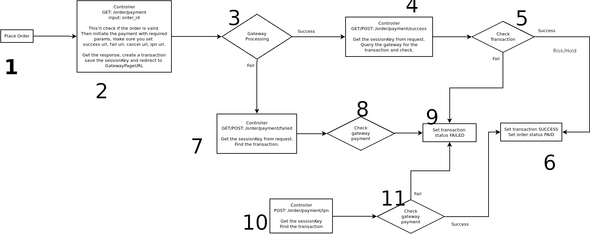

# Sslcommerz_Payment  

For React Apps(Androids/iOS) development Team can't use SDK Of Sslcommerz Payment.
So we created this module for  WebView Version For Payment Payment.

http://domain.com/order/payment?order_id=3427

Demo: https://youtu.be/EsfWiF5Qj1s

## Work Flow: sslcommarzWebView payment

#### Steps-1: OrderPlaced as Pending

        -Order Place & Redirect to Controller/Payment/Index.php

#### Steps-2: Controller/Payment/Index.php Get Methods

        -  get Order base_url/order/payment?order_id=3427
        -  make PostData by order_id
        - Order Checked validity only pending_payment accept for payment
        - Initiate payment
        - 4 Controller/returnUrl success,cancel,fail,ipn
        - get Respone & Transaction init save
        - redirect to Gateway

#### Steps-3: Gateway Processing
        - If success Next step=>4
        - If Fail Next step=>7
        - If cancel/close before payment Next step=>000

#### Steps-4: Success [Controller/Payment/Success.php]
        -  getPostValue
        - responseAction

#### Steps-5:  Query to getaway
        - sslcommerz_hash_key return val or not then next step of success or errorAction
        - order state 'pending_payment' or not
        - orderValidationApi $val_id call Gateway get response from Gateway return orderData
        - $response['status'] == 'VALID' Next=>Success/step6
        - $response['status'] not 'VALID' Next=> FAILED/Step 9

#### Steps-6: Set Transaction Success/Hold
        - if risk_level=0 set STATE_PROCESSING
        - if risk_level=1 set  hold/STATE_HOLDED

#### Steps-7: Canceled Action [Controller/Payment/Cancel.php]
      - get cancel postResponse

#### Steps-8: Same as 5
      - errorAction($postResponse)
      - Query to Gateway [transactionValidation($response['tran_id'])]

#### Steps-9: Cancel Order
        - errorAction($response) Query to Gateway transactionValidation($response['tran_id'])
        - Gateway return transaction as "FAILED"/"CANCELLED"  then set Order as cancel/STATE_CANCELED
        - transactionFinal save

#### Steps-10: IPN [Controller/Payment/Ipn.php]
      - receive response
      - Sent to ipnAction with [Ipn PostValue]

#### Steps-11:Check Gateway
      - ipnAction Query to Gateway via  [orderValidationApi]
      - step 6/9[success or fails action]

#### Steps-12: Finally

### Developer

Thank you for watching guide.If you have any questions about this practice, please feel free to leave a comment or Please do not hesitate to contact me don't worry about charge I try to help  on my little knowledge, if you need me to join your Magento project especially extension development.

- Abdul Matin

- Skype/gmail/hangout:matinict

- Mobile/What-apps: +8801717676441

- Github: https://github.com/matinict

- Magento Developer Program Member & Community Contributors
